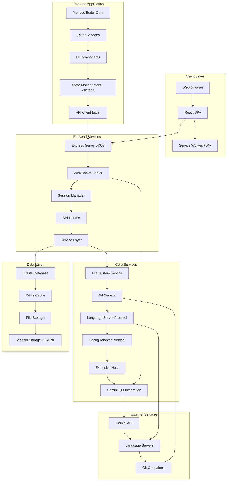
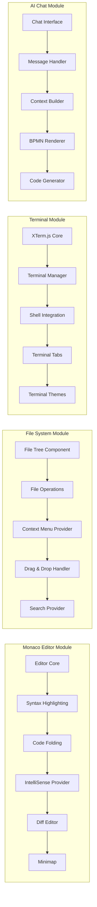
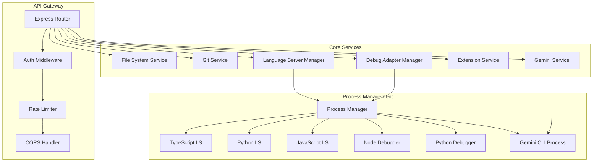
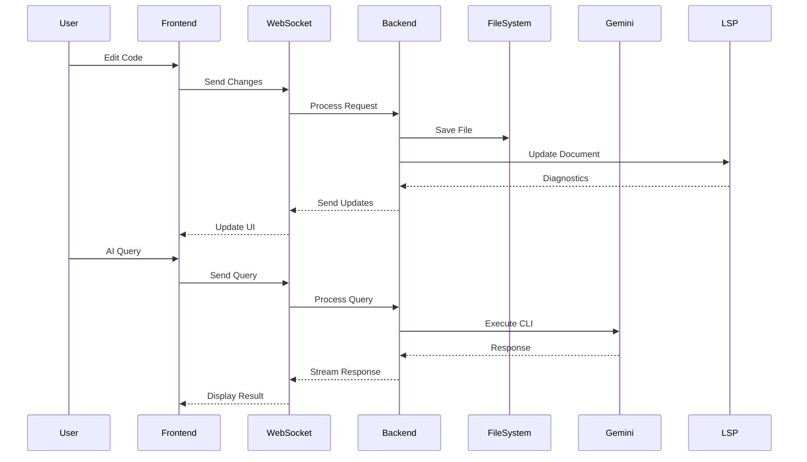

# Technical Architecture - Web-Based IDE with Gemini CLI Integration

## System Overview

The IDE architecture follows a modular, microservices-inspired design with clear separation of concerns between frontend, backend, and external services.

## High-Level Architecture



## Component Architecture

### Frontend Components



### Backend Services Architecture



## Data Flow Architecture



## State Management Architecture

```typescript
// Zustand Store Structure
interface IDEStore {
  // Editor State
  editor: {
    activeFile: string | null
    openTabs: Tab[]
    splitView: SplitViewConfig
    cursorPosition: Position
    selections: Selection[]
  }
  
  // File System State
  fileSystem: {
    projectTree: FileNode[]
    expandedFolders: Set<string>
    selectedFiles: Set<string>
    fileChanges: Map<string, FileChange>
  }
  
  // Terminal State
  terminal: {
    sessions: TerminalSession[]
    activeSessionId: string
    history: CommandHistory[]
  }
  
  // AI Chat State
  aiChat: {
    conversations: Conversation[]
    activeConversationId: string
    context: AIContext
    bpmnDiagrams: BPMNDiagram[]
  }
  
  // Git State
  git: {
    currentBranch: string
    status: GitStatus
    stagedFiles: string[]
    commits: Commit[]
    remotes: Remote[]
  }
  
  // Debug State
  debug: {
    sessions: DebugSession[]
    breakpoints: Breakpoint[]
    callStack: StackFrame[]
    variables: Variable[]
    watchExpressions: WatchExpression[]
  }
  
  // Extension State
  extensions: {
    installed: Extension[]
    enabled: Set<string>
    settings: ExtensionSettings
  }
  
  // UI State
  ui: {
    theme: Theme
    layout: LayoutConfig
    notifications: Notification[]
    commandPalette: CommandPaletteState
    searchPanel: SearchPanelState
  }
}
```

## Security Architecture


## Performance Optimization Strategy

### Frontend Performance

```typescript
// Code Splitting Configuration
const routes = {
  editor: () => import(/* webpackChunkName: "editor" */ './Editor'),
  terminal: () => import(/* webpackChunkName: "terminal" */ './Terminal'),
  git: () => import(/* webpackChunkName: "git" */ './GitPanel'),
  debug: () => import(/* webpackChunkName: "debug" */ './Debugger'),
  extensions: () => import(/* webpackChunkName: "extensions" */ './Extensions')
}

// Virtual Scrolling for File Tree
interface VirtualScrollConfig {
  itemHeight: number
  bufferSize: number
  scrollDebounce: number
  renderBatchSize: number
}

// Monaco Worker Configuration
const monacoWorkerConfig = {
  'editor.worker': () => new Worker('/monaco-editor/esm/vs/editor/editor.worker.js'),
  'json.worker': () => new Worker('/monaco-editor/esm/vs/language/json/json.worker.js'),
  'typescript.worker': () => new Worker('/monaco-editor/esm/vs/language/typescript/ts.worker.js'),
  'html.worker': () => new Worker('/monaco-editor/esm/vs/language/html/html.worker.js'),
  'css.worker': () => new Worker('/monaco-editor/esm/vs/language/css/css.worker.js')
}
```

### Backend Performance

```typescript
// Caching Strategy
interface CacheConfig {
  fileContent: {
    ttl: 300, // 5 minutes
    maxSize: '100MB'
  },
  lspResponses: {
    ttl: 60, // 1 minute
    maxSize: '50MB'
  },
  gitOperations: {
    ttl: 30, // 30 seconds
    maxSize: '20MB'
  },
  aiResponses: {
    ttl: 600, // 10 minutes
    maxSize: '200MB'
  }
}

// Process Pool Configuration
interface ProcessPoolConfig {
  languageServers: {
    maxProcesses: 10,
    idleTimeout: 300000, // 5 minutes
    memoryLimit: '512MB'
  },
  debugAdapters: {
    maxProcesses: 5,
    idleTimeout: 600000, // 10 minutes
    memoryLimit: '256MB'
  },
  terminals: {
    maxProcesses: 20,
    idleTimeout: 1800000, // 30 minutes
    memoryLimit: '128MB'
  }
}
```

## Extension System Architecture

```typescript
// Extension API
interface ExtensionAPI {
  // Editor API
  editor: {
    getActiveEditor(): Editor | undefined
    openFile(uri: string): Promise<Editor>
    onDidChangeActiveEditor: Event<Editor>
  }
  
  // File System API
  fileSystem: {
    readFile(uri: string): Promise<string>
    writeFile(uri: string, content: string): Promise<void>
    onDidChangeFile: Event<FileChangeEvent>
  }
  
  // Terminal API
  terminal: {
    createTerminal(options: TerminalOptions): Terminal
    onDidOpenTerminal: Event<Terminal>
    onDidCloseTerminal: Event<Terminal>
  }
  
  // Commands API
  commands: {
    registerCommand(id: string, handler: CommandHandler): Disposable
    executeCommand(id: string, ...args: any[]): Promise<any>
  }
  
  // UI API
  ui: {
    showMessage(message: string, type: MessageType): void
    showInputBox(options: InputBoxOptions): Promise<string>
    createStatusBarItem(options: StatusBarItemOptions): StatusBarItem
  }
  
  // Language API
  languages: {
    registerCompletionProvider(selector: DocumentSelector, provider: CompletionProvider): Disposable
    registerHoverProvider(selector: DocumentSelector, provider: HoverProvider): Disposable
    registerDefinitionProvider(selector: DocumentSelector, provider: DefinitionProvider): Disposable
  }
}

// Extension Manifest
interface ExtensionManifest {
  name: string
  version: string
  displayName: string
  description: string
  author: string
  main: string
  contributes: {
    commands?: Command[]
    languages?: Language[]
    themes?: Theme[]
    keybindings?: Keybinding[]
    menus?: Menu[]
  }
  activationEvents: string[]
  dependencies?: Record<string, string>
  extensionDependencies?: string[]
}
```

## Deployment Architecture

```yaml
# Kubernetes Deployment Configuration
apiVersion: apps/v1
kind: Deployment
metadata:
  name: gemini-ide
spec:
  replicas: 3
  selector:
    matchLabels:
      app: gemini-ide
  template:
    metadata:
      labels:
        app: gemini-ide
    spec:
      containers:
      - name: frontend
        image: gemini-ide-frontend:latest
        ports:
        - containerPort: 4009
        resources:
          requests:
            memory: "256Mi"
            cpu: "250m"
          limits:
            memory: "512Mi"
            cpu: "500m"
            
      - name: backend
        image: gemini-ide-backend:latest
        ports:
        - containerPort: 4008
        env:
        - name: DATABASE_URL
          valueFrom:
            secretKeyRef:
              name: gemini-ide-secrets
              key: database-url
        - name: GEMINI_API_KEY
          valueFrom:
            secretKeyRef:
              name: gemini-ide-secrets
              key: gemini-api-key
        resources:
          requests:
            memory: "512Mi"
            cpu: "500m"
          limits:
            memory: "1Gi"
            cpu: "1000m"
            
      - name: redis
        image: redis:alpine
        ports:
        - containerPort: 6379
        resources:
          requests:
            memory: "128Mi"
            cpu: "100m"
          limits:
            memory: "256Mi"
            cpu: "200m"
```

## Monitoring and Observability

```typescript
// Metrics Collection
interface MetricsCollector {
  // Performance Metrics
  performance: {
    pageLoadTime: Histogram
    apiResponseTime: Histogram
    websocketLatency: Histogram
    editorRenderTime: Histogram
  }
  
  // User Metrics
  user: {
    activeUsers: Gauge
    sessionDuration: Histogram
    featureUsage: Counter
    errorRate: Counter
  }
  
  // System Metrics
  system: {
    cpuUsage: Gauge
    memoryUsage: Gauge
    processCount: Gauge
    diskIO: Counter
  }
  
  // Business Metrics
  business: {
    aiInteractions: Counter
    codeCompletions: Counter
    debugSessions: Counter
    gitOperations: Counter
  }
}

// Logging Configuration
interface LoggingConfig {
  levels: {
    error: 'error',
    warn: 'warn',
    info: 'info',
    debug: 'debug',
    trace: 'trace'
  }
  
  transports: [
    {
      type: 'console',
      level: 'info',
      format: 'json'
    },
    {
      type: 'file',
      level: 'debug',
      filename: 'app.log',
      maxSize: '100MB',
      maxFiles: 10
    },
    {
      type: 'elasticsearch',
      level: 'info',
      index: 'gemini-ide-logs'
    }
  ]
}
```

## Error Handling Strategy

```typescript
// Global Error Handler
class ErrorHandler {
  private errorBoundaries: Map<string, ErrorBoundary> = new Map()
  private errorReporter: ErrorReporter
  
  handleError(error: Error, context: ErrorContext): void {
    // Log error
    logger.error('Application error', {
      error: error.message,
      stack: error.stack,
      context
    })
    
    // Report to monitoring service
    this.errorReporter.report(error, context)
    
    // Show user-friendly message
    if (context.userFacing) {
      this.showUserError(error, context)
    }
    
    // Attempt recovery
    if (context.recoverable) {
      this.attemptRecovery(error, context)
    }
  }
  
  private showUserError(error: Error, context: ErrorContext): void {
    const message = this.getUserFriendlyMessage(error)
    const severity = this.getErrorSeverity(error)
    
    notificationService.show({
      message,
      severity,
      actions: this.getErrorActions(error, context)
    })
  }
  
  private attemptRecovery(error: Error, context: ErrorContext): void {
    switch (context.component) {
      case 'editor':
        this.recoverEditor(error)
        break
      case 'terminal':
        this.recoverTerminal(error)
        break
      case 'lsp':
        this.recoverLanguageServer(error)
        break
      case 'ai':
        this.recoverAIService(error)
        break
    }
  }
}
```

## Testing Architecture

```typescript
// Test Configuration
interface TestConfig {
  unit: {
    framework: 'jest',
    coverage: {
      threshold: {
        global: {
          branches: 80,
          functions: 80,
          lines: 80,
          statements: 80
        }
      }
    }
  },
  
  integration: {
    framework: 'jest',
    setupFiles: ['./test/setup.ts'],
    testEnvironment: 'node'
  },
  
  e2e: {
    framework: 'playwright',
    browsers: ['chromium', 'firefox', 'webkit'],
    baseURL: 'http://localhost:4009'
  }
}

// Test Utilities
class TestUtils {
  // Mock factories
  static createMockEditor(): MockEditor {
    return {
      getValue: jest.fn(),
      setValue: jest.fn(),
      getPosition: jest.fn(),
      setPosition: jest.fn(),
      onDidChangeContent: jest.fn()
    }
  }
  
  static createMockFileSystem(): MockFileSystem {
    return {
      readFile: jest.fn(),
      writeFile: jest.fn(),
      deleteFile: jest.fn(),
      listFiles: jest.fn()
    }
  }
  
  static createMockGeminiService(): MockGeminiService {
    return {
      sendMessage: jest.fn(),
      streamResponse: jest.fn(),
      getContext: jest.fn()
    }
  }
}
```

## Migration Strategy

### Phase 1: Core Infrastructure
1. Set up new project structure
2. Configure build tools (Vite, TypeScript)
3. Set up testing framework
4. Configure CI/CD pipeline

### Phase 2: Component Migration
1. Migrate authentication system
2. Migrate file system operations
3. Replace CodeMirror with Monaco
4. Migrate Git integration
5. Migrate AI chat interface

### Phase 3: New Feature Implementation
1. Implement multi-tab system
2. Add xterm.js terminal
3. Implement debugging support
4. Add IntelliSense/LSP
5. Implement extension system

### Phase 4: Testing and Optimization
1. Comprehensive testing
2. Performance optimization
3. Security audit
4. Documentation
5. User acceptance testing

## Conclusion

This technical architecture provides a solid foundation for building a professional-grade web-based IDE with Gemini CLI integration. The modular design ensures scalability, maintainability, and the ability to evolve the system over time.

Key architectural decisions:
- Microservices-inspired backend for scalability
- Component-based frontend for maintainability
- Process isolation for stability
- Comprehensive security layers
- Performance-first design
- Extensible plugin system

The architecture supports both the immediate goals of the MVP and the long-term vision of a comprehensive development environment.